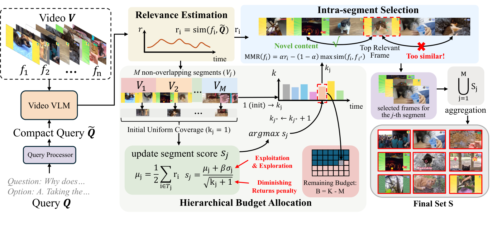

# HFS: Hierarchical Frame Selection for Budgeted Long Video Reasoning

Training-free inference-time frame selection for long video question answering (VQA).
HFS consistently outperforms uniform sampling across multiple benchmarks without any fine-tuning.

---

## Overview

Modern Video-Language Models (VLMs) can process only a limited number of frames under practical computational budgets. A common strategy — uniform sampling — ignores the query and often misses critical evidence. Relevance-only selection overcomes this but leads to **temporal collapse**: selected frames cluster around a few local peaks, losing global temporal context.

HFS resolves this by addressing frame selection **hierarchically**:

- **Global level** — distribute the frame budget across temporal segments, balancing query relevance and temporal coverage.
- **Local level** — within each segment, suppress near-duplicate frames while preserving informative evidence.

The entire process is training-free and integrates seamlessly with existing VLM pipelines.

---

## Framework



The pipeline consists of three stages:

### 1. Query-Aware Relevance Estimation

A frozen CLIP model (ViT-L/14, FP16) scores each candidate frame against a compact query derived from the question. The question is truncated to 320 characters to remove answer-option noise. Relevance scores are min-max normalised for stability across videos.

```
r_i = cosine_sim(CLIP(frame_i), CLIP(query))
```

### 2. Hierarchical Budget Allocation

The video is partitioned into **M = 24** non-overlapping temporal segments. Each segment is first assigned one frame to guarantee minimum temporal coverage. The remaining budget is then distributed iteratively via a UCB-style scoring function:

```
s_j = (μ_j + β × σ_j) / √(k_j + 1)
```

where:
- **μ_j** = mean of the top-2 relevance scores in segment j (focuses on peak relevance, robust to noise)
- **σ_j** = standard deviation of relevance scores in segment j (rewards segments with diverse candidate frames)
- **√(k_j + 1)** = diminishing-returns penalty that prevents over-allocation to already-selected segments
- **β = 0.35** balances exploitation (relevance) and exploration (diversity)

At each step, the segment with the highest score receives one additional frame budget.

### 3. Intra-Segment Frame Selection

Within each allocated segment, frames are selected greedily using **Maximal Marginal Relevance (MMR)**:

```
MMR(f_i) = α × r_i − (1 − α) × max_{f_i' ∈ selected} cosine_sim(f_i, f_i')
```

This criterion rewards frames that are both **query-relevant** and **visually distinct** from already-selected frames, suppressing near-duplicate content. The trade-off parameter **α = 0.72**.

Selected frames from all segments are aggregated into the final set S of **K = 128** frames.

---

## Results

| Model | Size | VideoMME (overall) | VideoMME (long) | MLVU (dev) | LongVideoBench |
|-------|------|--------------------|-----------------|------------|----------------|
| Qwen2.5-VL | 7B | 64.0 | 54.3 | 64.4 | 58.7 |
| Video-R1 | 7B | 61.1 | 51.4 | 65.0 | 52.0 |
| LLaVA-Video | 7B | 63.3 | 52.1 | — | — |
| **HFS (ours)** | **7B** | **65.5** | **56.3** | **68.4** | **61.3** |

HFS also generalises across different backbones (LongVA +1.6%, LLaVA-Video +1.5%, Qwen3.5-4B +0.5%) and frame budgets (32 / 64 / 128 frames).

---

## Repository Structure

```
HFS/
├── hfs/                        # HFS method
│   ├── frame_selection.py      # Core algorithm: UCB budget allocation + MMR frame selection
│   ├── qwen2_5_vl_hfs.py      # lmms-eval model plugin (Qwen2.5-VL + HFS)
│   └── lmms-eval/              # lmms-eval framework (git submodule)
├── assets/
│   └── framework.png
├── examples/
│   └── run_videomme_hfs.sh    # SLURM / direct run script
├── setup.sh                   # One-time setup: installs lmms-eval + registers model
└── requirements.txt
```

---

## Installation

### 1. Clone with submodules

```bash
git clone --recurse-submodules https://github.com/lwpyh/HFS.git
cd HFS
```

### 2. Run setup

```bash
bash setup.sh
```

This will:
1. Install `hfs/lmms-eval` as a Python package
2. Copy the HFS model plugin into lmms-eval
3. Register `qwen2_5_vl_hfs` in lmms-eval's model registry
4. Install additional dependencies (`transformers`, `qwen-vl-utils`, `opencv-python`, etc.)

---

## Run

### HFS

```bash
cd hfs/lmms-eval
PYTHONPATH="$PWD/../.." accelerate launch \
    --num_processes 1 --num_machines 1 \
    --dynamo_backend no --mixed_precision bf16 \
    -m lmms_eval \
    --model qwen2_5_vl_hfs \
    --model_args "pretrained=Qwen/Qwen2.5-VL-7B-Instruct,\
max_pixels=6422528,min_pixels=200704,\
attn_implementation=flash_attention_2,\
method=hfs" \
    --tasks videomme \
    --batch_size 1 \
    --log_samples \
    --output_path ../../logs/videomme_hfs
```

### Baseline (uniform 128 frames)

```bash
cd hfs/lmms-eval
PYTHONPATH="$PWD/../.." accelerate launch \
    --num_processes 1 --num_machines 1 \
    --dynamo_backend no --mixed_precision bf16 \
    -m lmms_eval \
    --model qwen2_5_vl_hfs \
    --model_args "pretrained=Qwen/Qwen2.5-VL-7B-Instruct,\
max_pixels=6422528,min_pixels=200704,\
attn_implementation=flash_attention_2,\
method=uniform_128" \
    --tasks videomme \
    --batch_size 1 \
    --log_samples \
    --output_path ../../logs/videomme_baseline
```

### SLURM

```bash
sbatch examples/run_videomme_hfs.sh            # HFS
sbatch examples/run_videomme_hfs.sh uniform_128 # baseline
```

---

## Arguments

| Argument | Default | Description |
|----------|---------|-------------|
| `pretrained` | `Qwen/Qwen2.5-VL-7B-Instruct` | HuggingFace model ID or local path |
| `method` | `hfs` | Frame selection method (`hfs` or `uniform_128`) |
| `max_pixels` | `1605632` | Max pixels per frame |
| `min_pixels` | `200704` | Min pixels per frame |
| `attn_implementation` | `flash_attention_2` | Attention backend |

---

## Hyper-parameters

| Parameter | Value | Description |
|-----------|-------|-------------|
| `cand_N` | 512 | Candidate frames uniformly sampled from the video |
| `out_K` | 128 | Frames fed to the VLM |
| `n_segs` | 24 | Temporal segments for UCB allocation |
| `β` | 0.35 | UCB exploration bonus (variation weight) |
| `α` | 0.72 | MMR relevance-diversity trade-off |
| CLIP model | `openai/clip-vit-large-patch14` | FP16, frozen |
